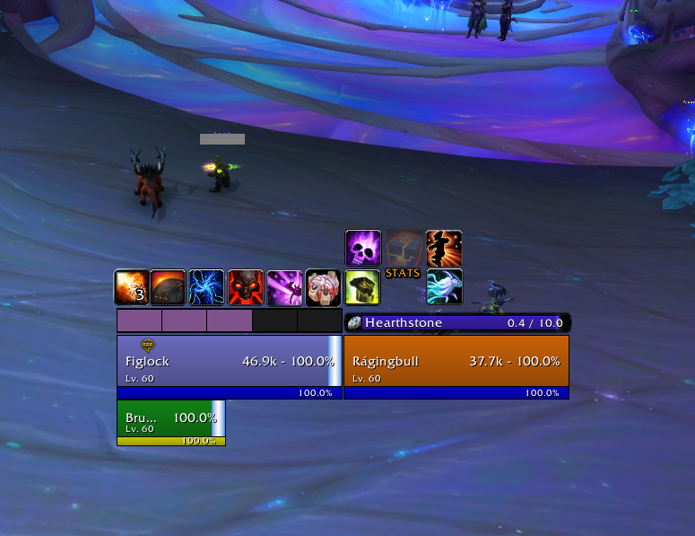

# FigUI

FigUI is a World of Warcraft AddOn that provides several movable unit frames that replace the default Blizzard frames.

## What FigUI Provides

- Player Frame
  - Custom resource bars for each class
    - **Feral Druid Combo Points not yet supported**
- Target Frame
- Target of Target Frame
- Pet Frame
- Debuff Tracker Frame
  - Larger frame dedicated to displaying information about the player's debuffs on the target

## What FigUI **Doesn't** Provide

- Party / Raid Frames
- Cast bars
- Nameplates

## Commands:

- `/fig`, `/fighelp` - Display help text / available commands
- `/figlock` - Toggle frame locks to allow frames to be moved
- `/figdebug` - Enable internal debug logging output to chat window

## Roadmap

- [ ] Combo points resource display for Feral Druid
- [ ] Show alternate resource bar on player frame for classes with a secondary resource
- [ ] **Per-frame Configuration**
- [ ] Visual pass (slim things down -- improve the design)
- [ ] Add texturing to all the custom resource bars

## Other Screenshots

